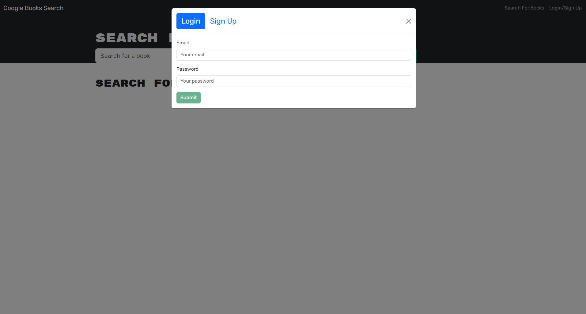

# Book Search API


  [](https://opensource.org/licenses/MIT)
  
  ## DESCRIPTION
This Google Book Search API is designed to search for books via the input, create a user, save/delete books from your searches. This was originally built with a RESTful API but has been refactored to use a GraphQL API built with Apollo Server. 
[Click here](https://book-search-api-vuu1.onrender.com/) to visit the book search site





  ## TABLE OF CONTENTS
  
  <ol>
  <li><a href="#description">Description</a></li>
  <li><a href="#installation">Installation</a></li>
  <li><a href="#usage">Usage</a></li>
  <li><a href="#licence">Licence</a> </li>
  <li><a href="#contributions">Contributions</a></li>
  <li><a href="#questions">Questions</a></li>
  </ol>
  
  ## INSTALLATION
To clone from Github, use GitBash   
```git@github.com:gaylemcclure/book-search-api.git```
  
  ## USAGE
  Upon installation of the project, start the app using the terminal with the following commands:   
  ```npm install```
  ```npm run dev```

  1. Search for books
  2. View the book list
  3. Sign up for a new user
  4. Login to existing user account
  5. Search for books and save to account
  6. View account & saved books
  7. Delete books from saved list

  
  ## LICENCE
  Distributed under the MIT license. For more information, see <a href=https://opensource.org/licenses/MIT>here</a>
  
  ## CONTRIBUTIONS
  Created by Gayle McClure   
  Uses JavaScript, node.js, mongoose db, express, Apollo Server, GraphQL, React
  
  
  ## QUESTIONS
  Github Username: <a href='https://github.com/gaylemcclure'>Gayle McClure</a>  
  Feel free to email me at gaylekdennison@gmail.com for further questions. 
